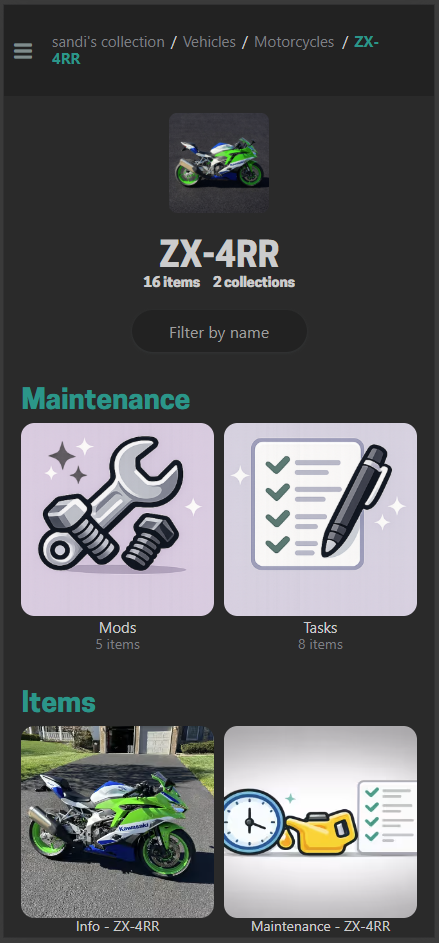
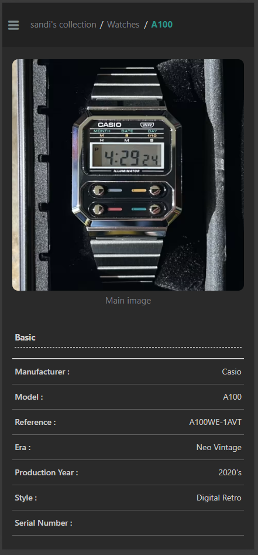
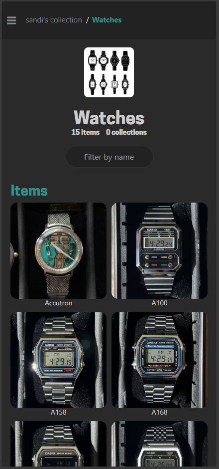

# koillection-facelift
A UI mod for [Koillection, collection manager](https://github.com/benjaminjonard/koillection)

## Why?

I use Koillection to manage very small collections.  I wanted the layout to look better on my phone so I made this mod that optimizes the layout on most phones. It also increases the resolution of thumbnail images as well so they no longer look pixilated on mobile devices. 

## Features

- Generates Larger Thumbnails and makes most thumbnails square
- Forces the collection thumbnail editor to make larger, square thumbnails
- Moves the Info section to the bottom of the page
- Hides the Info section by default
- Shows very wide list-thumbnails in their original aspect ratio
- Improved display of Item details on most screen sizes 

## Screenshots

  

## Installation 

- Download the [latest release package](//github.com/sandi-exe/koillection-facelift/releases/latest) of this project to your local machine
- Set the Theme to `dark` in your your Koillection > Settings `https://<your domain>/settings`
- Copy the contents of dark.css from the ccs directory of the latest release package to the "Custom CSS dark for dark theme" section of your Koillection Administration > Configuration page `https://<your domain>/admin/configuration`
- Copy `docker-compose.override.yml` and `patch-and-start.sh` from the docker directory of the latest release package to your koillection docker directory (the same directory as koillections's docker-compose.yml file)
- Restart your koillection container usually  `docker-compose down` then `docker-compose up -d`
- Thats it!
